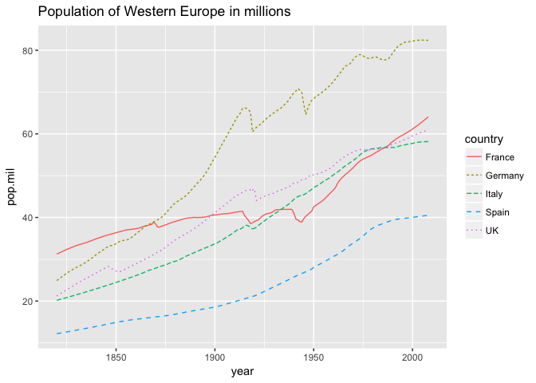
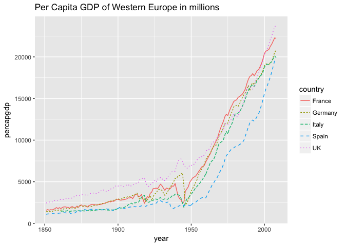
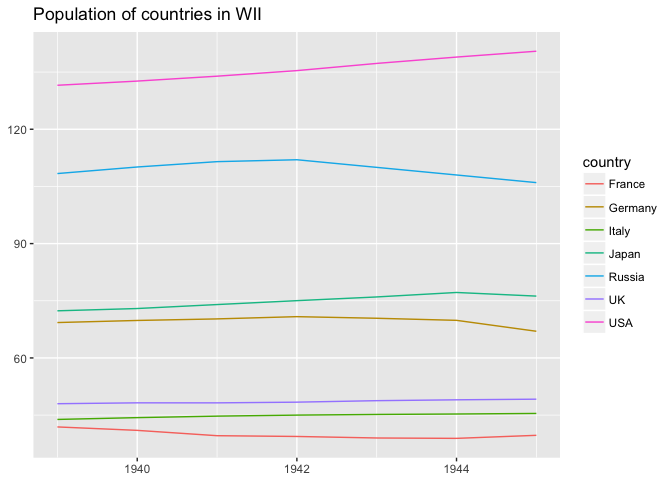

Historical visualizations
================
Started March 2018

``` r
library(readr)
library(dplyr)
library(ggplot2)
```

``` r
library(tidyr)

gdp <- read_csv("~/Downloads/Aggegrated_History - PerCapGDP.csv") %>%
  gather(key = "country", value = "percapgdp", France:Africa) %>%
  select(-parameter)
pop <- read_csv("~/Downloads/Aggegrated_History - Pop.csv") %>%
  gather(key = "country", value = "population", France:Africa) %>%
  select(-parameter)
pp <- inner_join(gdp, pop, by = c("year", "country")) 
write_csv(pp, "/Users/Malaquias/Google Drive/DATA/History/Aggregated_History_Long.csv")
```

``` r
pop <- read_csv("/Users/Malaquias/Google Drive/DATA/History/Aggregated_History_Long.csv")
pop$pop.mil <- pop$population/1000 # Convert population to millions
```

This should begin with some data exploration. Maps would work well for this.

``` r
Western.Europe <- c("France", "Germany", "Italy", "Spain", "UK") 

pop %>%
  filter(year > 1700, country %in% Western.Europe) %>%
  ggplot() +
  geom_line(aes(x = year, y= pop.mil, color = country, linetype = country)) +
  ggtitle("Population of Western Europe in millions")
```



``` r
pop %>%
  filter(year > 1850, country %in% Western.Europe) %>%
  ggplot() +
  geom_line(aes(x = year, y= percapgdp, color = country, linetype = country)) + 
  ggtitle("Per Capita GDP of Western Europe in millions") 
```

    ## Warning: Removed 10 rows containing missing values (geom_path).



``` r
# What are the units for this???
```

#### World War II

Axis powers and

``` r
unique(pop$country)
```

    ##  [1] "France"    "Germany"   "Italy"     "UK"        "Spain"    
    ##  [6] "USA"       "Russia"    "Argentina" "Chile"     "Mexico"   
    ## [11] "Cuba"      "China"     "India"     "Japan"     "Hong Kong"
    ## [16] "Malaysia"  "Sri Lanka" "Turkey"    "Africa"

``` r
ww2.countries <- c("USA", "UK", "France", "Germany", "Italy", "Russia", "Japan")

pop %>%
  filter(year >= 1939, year <= 1945, country %in% ww2.countries) %>%
  ggplot() + 
  geom_line(aes(x = year, y = pop.mil, color = country)) +
  xlab(NULL) + ylab(NULL) + 
  ggtitle("Population of countries in WII")
```


